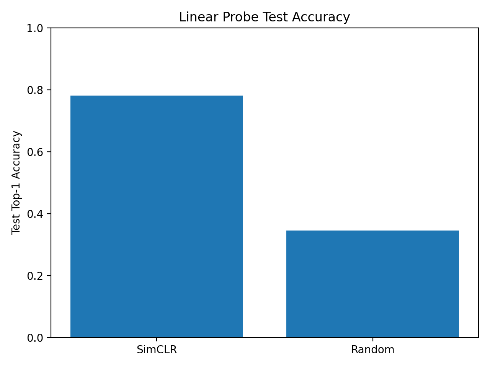
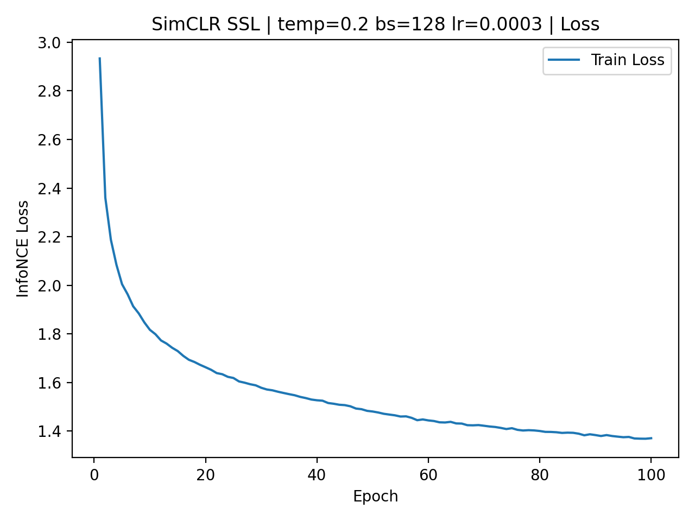
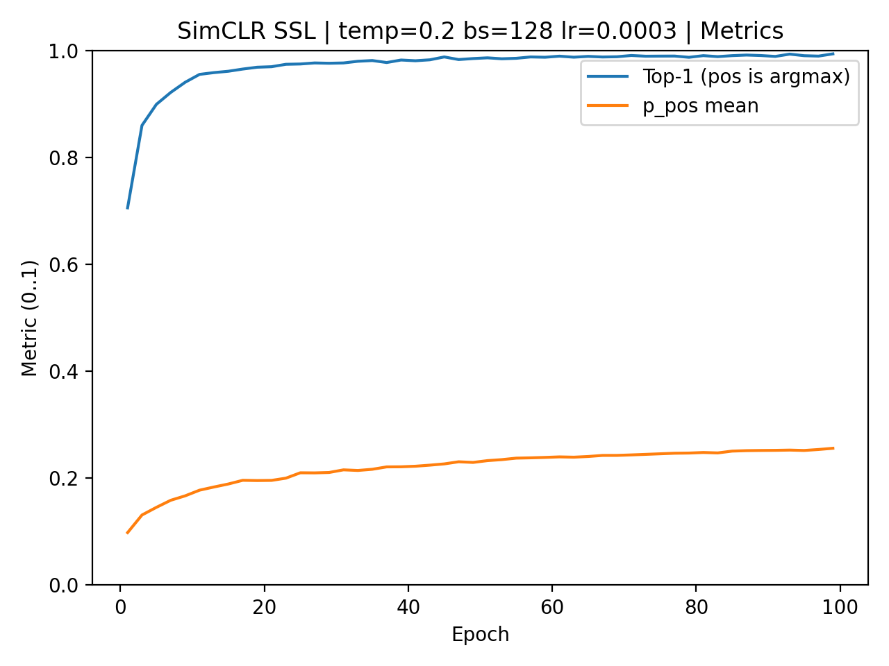
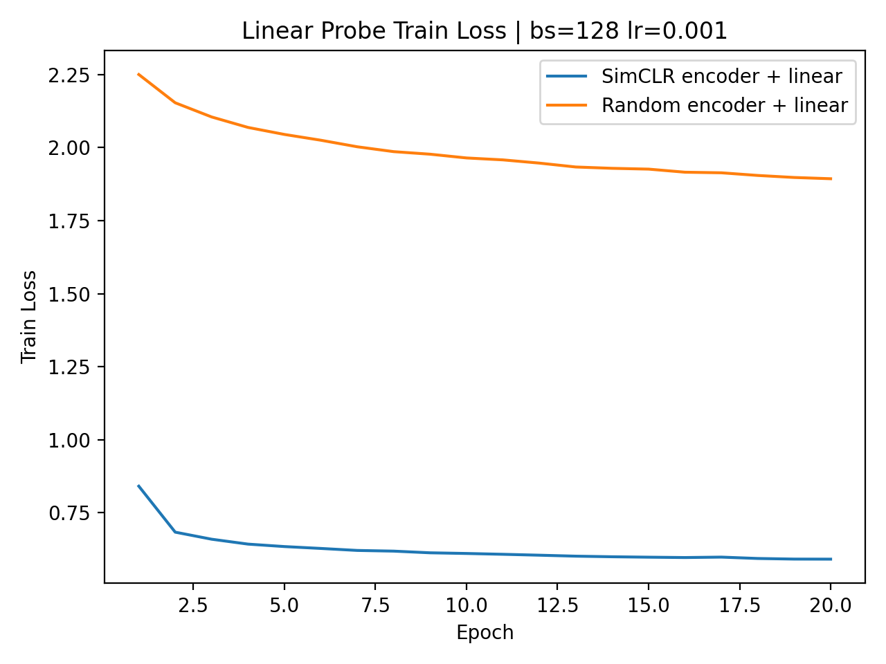

# simclr-from-scratch
From-scratch implementation of SimCLR in PyTorch, with a clean contrastive training pipeline and linear-probe evaluation to demonstrate how self-supervised learning produces linearly separable visual representations.

## Key concepts
- **SimCLR:** learns visual representations by training a CNN to pull together two augmented views of the same image (positive pair) while pushing them away from all other images in the batch (negatives). Although the objective is local, it implicitly encourages the network to learn reusable filters that capture stable, high-level structure, leading to globally organized representations.
- **Augmentations define semantics:** strong augmentations (crop, color jitter, blur, flip) specify which variations should be ignored. Only features that remain stable across these transformations can satisfy the contrastive objective, which naturally aligns learned features with semantic properties shared across images.
- **Temperature scaling:** controls how probability mass is distributed in the softmax over similarities and therefore how gradient contributions are weighted. Lower temperatures concentrate gradients on a few high-probability pairs, while higher temperatures distribute learning more evenly across the batch.
- **Hard negatives:** are negative examples that receive a large share of the softmax probability mass and thus contribute strongly to the gradient. Lower temperatures amplify their influence, forcing the model to explicitly separate them from the positive pair.

## Implementation details
- Encoder: `ResNet18` from torchvision, modified for CIFAR-10 (3x3 conv1, stride 1, no maxpool, fc -> `Identity`).
- Projection head: 2-layer MLP `512 -> 512 -> 128` with ReLU (`ProjektionHead` in `architecture.py`).
- SSL dataset wrapper: `SSLAugmentation` returns two independently augmented views of the same image.
- Augmentations: `RandomResizedCrop(32, scale=(0.3, 1))`, `RandomHorizontalFlip`, `ColorJitter` (p=0.8), `GaussianBlur` (p=0.5), then normalize.
- Similarity and loss (InfoNCE / NT-Xent):
  - `z1 = normalize(g(f(x1)))`, `z2 = normalize(g(f(x2)))`
  - `Z = [z1; z2]`, `S = Z @ Z.T` (shape `2B x 2B`), mask diagonal
  - `targets = (arange(N) + B) % N`, `loss = cross_entropy(S / temp, targets)`
- Metrics during SSL: InfoNCE loss, `p_pos` mean, and top-1 (positive is argmax), evaluated every 2 epochs on 40 batches.
- Training config: AdamW (`lr=3e-4`, `weight_decay=1e-4`), `batch_size=128`, `temp=0.2`, `epochs=100`.
- Checkpointing and logs: `checkpoints/latest.pt` and `logs/ssl_results.pt` saved every 10 epochs.

## Results (CIFAR-10, single machine)
Linear probing is the primary evaluation signal in contrastive learning: it tests whether a simple linear classifier can separate classes using frozen features, isolating representation quality from classifier capacity. This makes it a clean, comparable measure for SSL methods.

| Encoder | Test accuracy |
| --- | --- |
| SimCLR pretrained | `0.7812` |
| Random init | `0.3452` |
| Delta | `0.4360` |

### Plots
<table>
  <tr>
    <td align="center">
      
      <br />
      <sub><b>Probe Accuracy:</b> Linear probe test accuracy for SimCLR vs random encoder.</sub>
      <br />
      <sub>Takeaway: a large gap means the pretrained features are easier separable.</sub>
    </td>
  </tr>
</table>

<table>
  <tr>
    <td align="center">
      
      <br />
      <sub><b>SSL Loss:</b> InfoNCE/NT-Xent training loss over epochs.</sub>
      <br />
      <sub>Takeaway: a steady decrease indicates stable contrastive optimization.</sub>
    </td>
    <td align="center">
      
      <br />
      <sub><b>SSL Metrics:</b> Mean p_pos and top-1 over epochs (top-1 is not classification accuracy).</sub>
      <br />
      <sub>Takeaway: rising p_pos/top-1 means positives dominate similarity within the batch.</sub>
    </td>
  </tr>
</table>

<table>
  <tr>
    <td align="center">
      
      <br />
      <sub><b>Probe Loss:</b> Linear probe train loss curves for both encoders.</sub>
      <br />
      <sub>Takeaway: lower loss for SimCLR indicates easier downstream optimization.</sub>
    </td>
  </tr>
</table>

#### Plot interpretation
- **SSL loss:** Should decrease as the model improves at separating positives from negatives; a smooth downward trend indicates stable contrastive training.
- **SSL metrics:** `p_pos` reflects how much probability mass the model assigns to the positive pair; “Top-1 (pos is argmax)” is a contrastive retrieval metric, not classification accuracy, and checks whether the positive pair has the highest similarity within the batch.
- **Probe accuracy:** The SimCLR bar should be substantially higher than random, showing that pretraining yields linearly separable features.
- **Probe loss:** Lower loss for the SimCLR encoder indicates faster and more stable convergence for the linear classifier.

### Why this matters
SimCLR pretraining should turn images into features that are linearly separable; the linear probe confirms this without adding classifier complexity. The large SimCLR vs random gap links self-supervised learning to downstream usefulness in a realistic, engineering-focused evaluation.


## How to run
### Setup
- Python 3.10 and PyTorch + torchvision (MPS is used automatically on Apple Silicon if available).
- For plots: matplotlib.

```bash
pip install torch torchvision matplotlib
```

### Train SSL
```bash
python train.py
```

### Run linear probe
```bash
python linear_probe.py
```

### Generate plots
```bash
python visualizations.py
```

### Outputs
- Checkpoints: `checkpoints/latest.pt`
- Logs: `logs/ssl_results.pt`, `logs/probe_results.pt`
- Plots: `plots/ssl_loss.png`, `plots/ssl_metrics.png`, `plots/probe_loss.png`, `plots/probe_accuracy.png`
- Data: `data/` (CIFAR-10 downloads via torchvision)

## Repository structure
- `architecture.py`: CIFAR-friendly ResNet18 and projection head.
- `engine.py`: SimCLR logits/targets, training loop, and SSL metrics.
- `train.py`: SSL training entry point and checkpoint/log handling.
- `linear_probe.py`: frozen-encoder linear probe and random baseline.
- `helpers.py`: augmentations, SSL dataset wrapper, device selection.
- `visualizations.py`: plot generation from saved logs.
- `plots/`, `logs/`, `checkpoints/`, `data/`: artifacts and datasets.

## Limitations and future work
- Sweep temperature and batch size for stability and performance.
- Try larger datasets (STL-10, ImageNet) and longer training schedules.

## What I learned / What this demonstrates
- Implemented the core SimCLR objective from scratch, including positive-pair indexing and masking, to understand the contrastive loss formulation.
- Built a clean self-supervised training pipeline with explicit logging of representation-quality metrics beyond the loss.
- Designed and ran a fair linear-probe evaluation with a random-encoder baseline to isolate and validate the quality of learned representations.
- Created clear visualizations and checkpoints to support debugging, analysis, and reproducible experiments.
- Demonstrated solid engineering practice (data pipeline, training loop, logging) together with experimental thinking (baselines, evaluation protocol).
